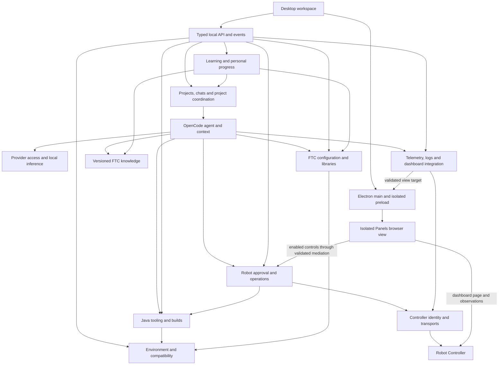
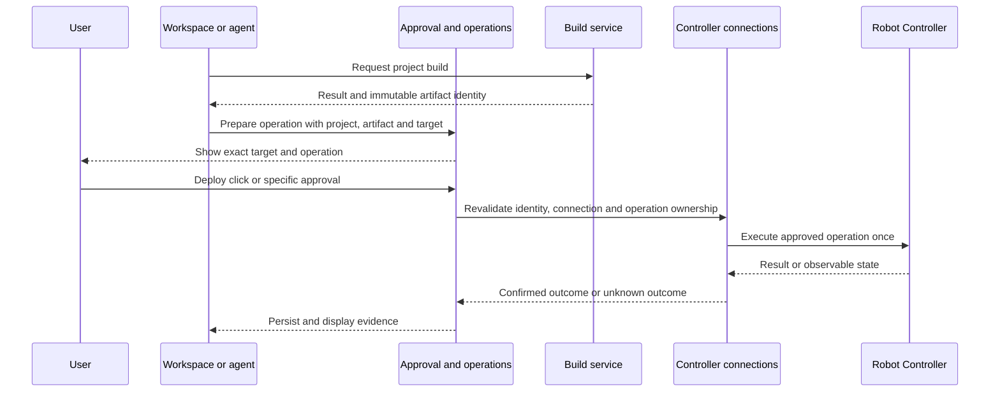

# FTC Programming Agent — High-Level Design

Date: 2026-10-06

Status: Proposed design for review; no product implementation or integration testing completed.

Requirements: [proposal.md](proposal.md)

Repository baseline inspected: `980594d33`.

## 1. Purpose, scope, and confirmed decisions

Adapt the existing OpenCode desktop application into a Java development and learning workspace for FTC teams on macOS and Windows. Beginners should progress toward independently programming, configuring, tuning, debugging, and deploying a complete robot; experienced students should retain direct access to their code and diagnostic evidence.

This document defines module responsibilities, relationships, state ownership, principal workflows, and evaluated technology recommendations. It preserves every first-version requirement in the proposal. It does not specify implementation tasks, complete API payloads, database migrations, or an untested release compatibility matrix.

The following clarifications were confirmed while developing this design:

| Topic | Confirmed decision |
| --- | --- |
| Design depth | Include evaluated recommendations for the editor, managed inference runtime, and storage. |
| Learning progress | Personal to the current local user, spanning projects; practical exercises link to the project used. No separate in-app student-profile system is required. |
| Shared configuration | Store non-secret hardware definitions and the managed pathing choice with the project so teammates can share them through Git. Keep chats, credentials, and personal progress local. |
| Offline AI hardware | Support varied team laptops through hardware-aware model choices. Establish tested minimum specifications later. |

Technical choices below are recommendations for this design, not additional product decisions attributed to the user. Exact component versions and supported model combinations must pass the evaluations in Section 10.

The proposal's exclusions remain: Blocks, writing or synchronizing robot-side hardware configuration, an app-operated AI billing/access service, and languages beyond English and Simplified Chinese. The descriptive document title does not establish a product brand.

## 2. Architecture and alternatives

**Recommend an extension of the existing desktop application with explicit FTC modules inside its local backend.** Retain the Electron shell, Solid application, typed client/server boundary, and OpenCode Session V2 engine. Use managed child processes for development tools and local inference; they are implementation adapters, not independently deployed services.

| Approach | Benefits | Costs and decision |
| --- | --- | --- |
| FTC modules in the existing application/backend | Reuses chats, lifecycle, UI, providers, and persistence; places project coordination and robot approvals beside execution. | Requires focused changes to backend integration points. **Recommended.** |
| Mostly OpenCode plugins and tools | Isolates reusable FTC assistance and reference material. | Editor integration, app-managed processes, project-wide coordination, and complete action mediation still need host changes. Use plugin mechanisms where useful, not as the sole architecture. |
| Separate FTC daemon alongside OpenCode | Stronger independent lifecycle for robot services. | Adds another process protocol, persistence boundary, and coordination authority. Not justified for the first desktop version. |

These are logical modules, not a requirement to create one package per module. Keep existing package boundaries and introduce only the interfaces needed by the product.

### Runtime relationships

Arrows show requests or supplied data, not package imports. UI requests cross the typed backend API unless they concern desktop-only window/process facilities.

The dashboard page has no application preload bridge. The agent receives diagnostic data from backend adapters and requests actions through the operation module; it does not drive dashboard buttons as an alternative execution path. Any robot-changing controls enabled in the embedded view must have their protocol messages mediated by M9 for controller coordination. Otherwise, block those writes and use application-owned operation controls. Direct user actions and agent-requested actions retain their different approval rules.

### Repository placement

| Existing area | Intended role |
| --- | --- |
| `packages/desktop` | Electron windows, narrow IPC, embedded dashboard lifecycle, OS credential protection, and host-level process facilities. |
| `packages/app`, `packages/ui`, `packages/session-ui` | Workspace, chat presentation, editor integration, hardware form, setup, lessons, statuses, and localized controls. |
| `packages/schema` | Shared identifiers and validated domain values without backend runtime dependencies. |
| `packages/core` | Domain services, project coordination, FTC context producers, tools, persistence, and integration adapters. |
| `packages/protocol`, `packages/server` | Public contracts, authorization, handlers, and event delivery. |
| `packages/client` | Generated client access. Runtime imports may use Schema/Protocol, never Core/Server. |
| `packages/opencode` | Existing desktop server composition and legacy development-tool foundations to integrate deliberately. |

The inspected desktop bundles a server from `packages/opencode/dist/node`; Java LSP code also currently lives under `packages/opencode`. This design does not claim those facilities already exist as complete V2 services in Core. Adapt or extract the necessary implementation behind the appropriate service boundary without reversing the repository's dependency direction or importing the entire legacy agent loop.

Preserve Schema → Core/Protocol → Server dependency direction and `sdk-next`'s composition role. Regenerate public clients with `bun run generate` in `packages/client` after Protocol/HttpApi changes; never hand-edit generated output.

## 3. Module responsibilities and interfaces

Interface names below express domain operations, not finalized HTTP routes.

| Module | Responsibility and principal interface | Dependencies and owned state |
| --- | --- | --- |
| **M1 — Desktop workspace** | Present projects/chats, chat-only or split editor layouts, setup, hardware form, diagnostics, approvals, and lessons. Observe backend status and submit explicit user actions. | Typed client; desktop IPC. Owns layout, open views, and editor view state. Never decides backend authorization. |
| **M2 — Projects and chats** | `createProject`, `openProject`, `createChat`, `submitPrompt`, `stopRun`, `activeChat`. Associate each chat with its own Session and enforce one active chat per project across windows. | Existing project/Location/Session services. Owns local folder associations, chat membership, and process-local project execution ownership. |
| **M3 — Agent and context** | Assemble project-specific context, call the selected model, execute permitted tools, and explain actual results. Apply plan-first/direct editing behavior. | Session V2, M2, M5–M7, M9–M11. Session history and context epochs stay Session-owned; domain facts stay with their producers. |
| **M4 — Environment and compatibility** | `inspectEnvironment`, `prepareEnvironment`, `readiness`. Detect tools, provide automatic/guided setup, resolve tested toolchain profiles, and verify offline resources. | OS process/download facilities and versioned compatibility manifests. Owns installed-tool inventory, setup-step results, and local asset availability. |
| **M5 — Java development** | Document open/change/save, completion, diagnostics, definition lookup, and `buildProject`. Serve the same diagnostic/build evidence to editor and agent. | M2/M4 and language-server/build adapters. Owns document revisions, language-service sessions, build runs, logs, and produced artifact identities. |
| **M6 — FTC configuration and libraries** | Read/validate/update shared hardware definitions; inspect dependencies; select/setup PedroPathing, Road Runner, or neither; propose Java mappings. | M4/M5/M11 and the code-change workflow. Owns the project manifest and mapping consistency status. Gradle files remain authoritative for actually installed dependencies. |
| **M7 — AI access and local inference** | Configure online credentials/models; select inference mode; download/start/stop managed models; connect to existing local services; report capability/readiness. | Existing provider adapters, protected credential access, host process manager. Owns model inventory and runtime status; no robot or file tools execute inside inference servers. |
| **M8 — Controller connections** | `discoverControllers`, `connect`, `selectTarget`, `connectionStatus`. Resolve controller identity, USB/Wi-Fi transports, authorization, and dashboard/data endpoints. | ADB and validated robot protocol adapters. Owns identity-to-transport bindings and connection generations; changing an address cannot silently change a target. |
| **M9 — Robot approvals and operations** | `prepareOperation`, `approveOperation`, `executeOperation`, `operationStatus`. Bind one deployment/control request to its target, parameters, and approving user; serialize conflicting operations. | M2/M5/M8 and existing permission facilities. Owns pending approvals, controller operation ownership, and durable outcomes. |
| **M10 — Diagnostics and dashboard** | `telemetrySnapshot`, `subscribeTelemetry`, `readRobotLogs`, `dashboardTarget`. Normalize robot observations separately from dashboard display. | M8, Panels adapters, M5 build evidence, M1/Electron view host. Owns bounded live buffers, provenance/freshness, and dashboard connection state. |
| **M11 — FTC knowledge** | Retrieve version-matched references and examples; supply bilingual library comparisons and explanations with sources. | Local content packages and compatibility metadata from M4/M6. Owns reference manifests and searchable content, not project facts or robot measurements. |
| **M12 — Learning** | Choose entry level, present lessons/exercises, select a pathing track, record evidence, and restore progress. | M2/M5/M6/M10/M11. Owns personal cross-project progress and project-linked exercise attempts. Course actions use ordinary coding/deployment approval paths. |

Localization and persistence support these modules; they do not introduce separate workflow authorities. Stable lesson IDs and domain error codes are language-independent. Existing typed localization patterns cover English and Simplified Chinese; API identifiers, user hardware names, and code are preserved.

## 4. Evaluated technology recommendations

These are source-based architecture evaluations, not benchmarks or completed compatibility tests. References were read during the 2026-10-05–2026-10-06 design session. Recommendations must be pinned to evaluated releases before implementation is shipped.

### Editor and Java services

**Recommend Monaco Editor with Eclipse JDT LS behind a project-scoped language-service adapter.** Monaco's URI-based document models fit persistent editing state across layout changes, while its provider APIs support connecting completion/navigation services. It is an editor component, not a complete VS Code extension host. [Monaco documentation](https://github.com/microsoft/monaco-editor)

CodeMirror is a viable alternative with modular editing, Java language support, completion, and diagnostic extension points. Prefer Monaco for the requested IDE-style experience; CodeMirror remains a fallback if integration or measured resource use makes Monaco unsuitable. Neither removes the need for dependency-aware Java tooling. This preference is a design judgment, not a measured performance comparison. [CodeMirror documentation](https://codemirror.net/)

JDT LS supplies completion, diagnostics, navigation, and Gradle support. However, its Android project import is explicitly experimental. Validate real FTC projects, Android classes, SDK classes, generated sources, and both pathing libraries before accepting the integration. A green Java syntax check is insufficient. If required, evaluate a Gradle-derived classpath/import adapter; do not rewrite a team's build to conceal language-server limitations. [JDT LS documentation](https://github.com/eclipse-jdtls/eclipse.jdt.ls)

Use a pinned editor runtime separately from each project's build JDK. Current JDT LS documentation requires Java 21 or later, and the existing repository launcher checks that minimum; this is not a decision to force every FTC Gradle build onto Java 21. Replace the existing launcher's reliance on global `java` and an unpinned latest download within the managed setup path. Bundle editor assets locally and validate workers under the desktop's actual application URL scheme.

### Managed and existing local inference

**Recommend an app-managed `llama.cpp` server with a curated model catalog**, connected through OpenCode's existing OpenAI-compatible provider path. Its documented CPU/GPU backends and quantized-model support make it a suitable candidate for varied laptops; application-owned binaries and model paths give explicit start/stop and version control. This entails maintaining platform builds, model downloads, checksums, licenses, and resource estimates. [llama.cpp](https://github.com/ggml-org/llama.cpp)

Ollama is the main alternative for managed inference: its model management reduces custom setup work, but the application's lifecycle must coexist with any user-installed Ollama service. Recommend supporting it, and LM Studio, as existing local-service connections first. The repository already documents provider configuration for all three. [Repository provider examples](../packages/web/src/content/docs/providers.mdx), [Ollama operation and configuration](https://docs.ollama.com/faq)

Keep inference and tool execution separate. Disable runtime-provided shell/file tools, built-in agents, and MCP execution in the managed inference server; OpenCode remains the single tool executor. Validate each model, quantization, template, context limit, and runtime combination for structured tool calls. An API-compatible server alone does not establish agent capability. [llama.cpp server documentation](https://github.com/ggml-org/llama.cpp/tree/master/tools/server)

Offline AI must stay on this computer. Restrict its provider connection to verified local inference, disallow redirects to remote providers, and provide no cloud fallback. Loopback alone is insufficient: a local service can proxy cloud models. For example, Ollama documents cloud-model features and a local-only setting. Validate supported external services in local-only operation; do not label arbitrary endpoints as verified offline. [Ollama local-only configuration](https://docs.ollama.com/faq#how-do-i-disable-ollama-cloud-features)

Choose catalog options from detected RAM, available GPU memory/backend, disk space, and the working context requirement. Include room for the desktop, Java tooling, Gradle, and concurrent projects. Explain trade-offs before download; report insufficient resources explicitly. Model names, minimum hardware, and speed claims remain subject to measured validation, as confirmed by the user.

Keep the selected online/offline mode visible. Online setup explains that the team supplies its provider credentials and pays its provider directly, and that relevant project code and telemetry may be transmitted to that provider. Switching the workspace layout does not change inference mode or permission settings.

### Storage, credentials, and content

**Recommend extending the existing SQLite/Drizzle persistence**, plus a schema-versioned JSON file in each project for shareable FTC configuration. This reuses the repository's local database and migration lifecycle while making robot definitions reviewable in Git. An all-JSON design would complicate chat/progress updates; an all-database design would make the confirmed sharing workflow less direct. [Existing database service](../packages/core/src/database/database.ts)

Recommend a file named `ftc-project.json` for hardware definitions and declared managed-library selection. The filename is a design recommendation, not an existing convention. Store neither credentials nor machine paths, chat history, personal progress, live telemetry, or action approvals in it. Maintain one authoritative manifest; any database projection is a rebuildable cache.

Use Electron `safeStorage` through a narrowly scoped main-process credential facility, with the encrypted record stored locally and only a credential reference exposed to ordinary domain records. Never return a secret through general model context, logs, or a renderer-readable listing. The current Core credential table stores a JSON value; OS-backed protection is required new integration work, not an existing guarantee. Electron documents Keychain-backed protection on macOS and DPAPI on Windows, with different same-user process protections. Handle unavailable/decryption-failed storage visibly and do not silently save plaintext. [Electron safeStorage](https://www.electronjs.org/docs/latest/api/safe-storage), [Existing credential table](../packages/core/src/credential/sql.ts)

Package lessons and selected references as local Markdown/JSON content with stable IDs, language, source, and applicable SDK/library versions. Start with explicit version filtering and ordinary text search; a vector database is not necessary to satisfy the proposal.

### Robot integration and dashboard

Retain project Gradle wrappers and Android/ADB tooling for builds and installation. Use version-specific adapters for Panels data/control interfaces rather than scraping a rendered page. The proposal's pinned Panels revision routes socket messages to plugins, and its OpModeControl plugin handles initialization/start and publishes state. This supports the adapter direction but does not prove tested end-to-end behavior. [Pinned socket source](https://github.com/ftcontrol/ftcontrol-panels/blob/11d69a98e39c43a7d9edc5932275897c034f7a30/library/Panels/src/main/java/com/bylazar/panels/server/Socket.kt), [Pinned OpModeControl source](https://github.com/ftcontrol/ftcontrol-panels/blob/11d69a98e39c43a7d9edc5932275897c034f7a30/library/OpModeControl/src/main/java/com/bylazar/opmodecontrol/OpModeControlPlugin.kt)

Use a distinct Electron `WebContentsView` for Panels, without the application preload, with Node integration disabled, context isolation and sandboxing enabled, and navigation/permissions limited to the intended dashboard resources. Validate focus, sizing, cleanup, assets, WebSockets, and USB endpoint forwarding. If embedding fails, open Panels externally while retaining backend telemetry and action adapters. [WebContentsView](https://www.electronjs.org/docs/latest/api/web-contents-view), [Electron isolation guidance](https://www.electronjs.org/docs/latest/tutorial/security)

## 5. State ownership and consistency

| Data | Authority and lifetime | Consistency rule |
| --- | --- | --- |
| Project code and dependencies | Team's local project files. | Opening/importing does not upgrade or replace them. Inspect changes made outside the app. |
| Hardware definitions and managed pathing choice | Project JSON manifest, owned by M6. | Form/chat use one validation and update path; revision checks prevent lost updates. Never write Robot Controller configuration. |
| Local project association and chats | Existing local database, owned by M2/Session services. | One chat maps to one Session. A copied manifest does not copy local chats or identify the physical controller. |
| Editor documents | M5 document models, separate from views. | Dirty buffer and disk revision stay distinct. Agent edits cannot silently overwrite unsaved or externally changed content. |
| Setup and compatibility metadata | M4 local inventory and versioned manifests. | Selected profile records a coherent tested combination, not independently chosen latest dependencies. |
| Personal progress | Local database, owned by M12. | Key by stable course/lesson version; record exercise project, evidence type, and attempt. Language switches do not reset progress. |
| Provider credentials | Protected local credential facility. | Decrypt only for the authorized provider operation; no project-file or context copy. |
| Builds and deployment evidence | M5 build record and M9 operation record. | Bind source/configuration revision, build result, APK digest, controller identity, and outcome. A stale APK is not a new successful build. |
| Telemetry and logs | M10 bounded buffers and selected recorded evidence. | Tag source, project association, connection generation, receive time, and available robot timestamp. Historical evidence is not live data. |
| Active runs and controller ownership | Process-local coordinator. | Shared across application windows. Restart clears active ownership; durable history is not an instruction to replay work. |
| Pending robot approvals | M9 current operation context. | Invalidate on target/connection changes, relevant parameter changes, restart, or consumption. Persist outcome history, not reusable authorization. |

Define the FTC project execution key from the locally associated, canonical project root. Multiple views and path aliases of that root must resolve to the same key. Map it explicitly to existing Project/Location/Session identities; neither a display name nor a copied manifest identifier is sufficient for locking.

Manifest updates validate hub/category/port/type/name relationships before replacement and publish a revisioned change event. A hardware rename can make existing Java references inconsistent: show that state and produce a corresponding code edit through the selected workflow. Do not imply that merely saving the form changed Java code or physical wiring.

Keep code-change mode, robot-action mode, inference mode, language, and workspace layout independent. Shared project files cannot grant permissions or change a user's provider credentials.

## 6. Agent lifecycle and project concurrency

The project coordinator adds a constraint around the existing Session lifecycle; it does not replace it with a project-wide conversation or a second agent loop.

1. Resolve the target chat's project and atomically check/reserve its active-chat ownership. A request for another chat in a busy project returns the active chat identity. Its text remains a draft and is not admitted as automatically runnable work.
2. For an allowed submission, call the existing Session prompt admission path. Preserve one durable `session_input` row before the advisory `SessionExecution.wake`, exact-retry reconciliation, and conflicting-ID rejection. `resume: false` remains admit-only, not a draft-submission shortcut.
3. Enforce the same project gate for all execution entry points, including explicit resume and advisory wakes. Resolve placement through the stored Session when a drain starts. No Session-ID-specific service layers are introduced.
4. The Session runner promotes steer/queue inputs at their existing safe boundaries, reloads projected history before continuation, and retains one `llm.stream(request)` call per provider turn. A queued input inside the active chat is distinct from an unsubmitted draft in another chat.
5. Keep project ownership through tool execution, approval waits, and interruption cleanup. Release it only after the active drain is settled. Admission failures release unused reservations; races between admission and drain completion must not strand ownership or start a second chat.
6. Other projects can run concurrently. Shared local-model resource pressure may expose a waiting state, but does not create one application-wide chat lock. Restart does not automatically retry interrupted provider work; recovery needs explicit user action and preserved Session semantics.

Plan-first mode requires a reviewed plan before mutations. Direct mode permits requested local editing/build checks. Both obtain context from the project's actual code, configuration, versions, references, and diagnostic snapshots, and both use M9 for robot actions.

Keep the System Context algebra/registry/built-ins in `src/system-context`. FTC configuration, knowledge, and diagnostics provide domain-owned Context Sources. Session History selection and Context Epoch persistence remain Session-owned.

## 7. Principal workflows

### Setup, project creation, and import

M1 collects language and automatic/guided setup choices. M4 detects working tools, presents missing/incompatible components, and records recoverable steps. Automatic setup downloads/configures selected prerequisites while surfacing licenses, OS permissions, and user-required steps; guided setup verifies the same readiness conditions.

M6 inspects or initializes the FTC project and offers the version-matched PedroPathing/Road Runner/neither comparison. New projects use a tested profile. Imported projects retain their build and source files; conflicts between detected dependencies and manifest selection require a user decision. Road Runner retains FTC Dashboard and tuning utilities when its selected version needs them.

The managed pathing selection permits exactly one of PedroPathing, Road Runner, or neither. Adding a library later uses the same setup path; it cannot silently add a second managed library or remove conflicting team code. This is the application's selection rule, not a claim that the libraries are technically incompatible.

M5 verifies a real build and separately reports language-service readiness. M4 tracks cached models, toolchains, build dependencies, lessons, and references so offline readiness is explicit. A failed step can be retried deliberately without reinstalling already valid tools or erasing team code.

### Edit, map hardware, and build

The hardware form follows Driver Station's recognizable hub, device-category, numbered-port, type, and name organization. Form edits and agent requests update M6's shared definitions through the same validation boundary. The agent inspects existing Java before proposing mapping changes and asks about missing names, ports, hardware, or measurements. Code generation follows the selected editing mode and explains the Driver Station configuration still required.

M5 preserves dirty editor buffers when switching layouts. Before an agent changes a dirty/conflicting file, show the conflict and require the user to save, merge, or defer; never implicitly discard it. Builds use identified saved input revisions. If unsaved buffers exist, make the build basis visible rather than implying the displayed unsaved program was compiled.

Build against a stable input snapshot or verify that relevant input revisions remained unchanged throughout the build. If a manual save or external edit changes them, mark the result as outdated instead of presenting its APK as the current project build.

Return structured evidence: project, operation ID, affected files/revisions, exit status, diagnostic availability, and artifact identity where produced. A build failure and an unavailable language server are different states.

### Deploy and perform an approved action

The Deploy button itself is deliberate authorization for the specified project/build/controller; it need not create a redundant second approval. Any target or artifact change requires a new deliberate action. Installation does not authorize program initialization/start, and code approval does not authorize installation.

Each agent control action binds the project, chat, controller identity, connection generation, operation kind, and exact parameters. For tuning, include the field/value and relevant expected state; for initialization/start, include the OpMode and required observed state. Revalidate immediately before dispatch. Expired or mismatched context cannot redirect an approval.

Use one application-wide controller coordinator to prevent conflicting operations from different projects, including USB and Wi-Fi aliases for the same robot. When identity cannot be established, block a mutating operation and ask the user to identify the target. Observation-only rejects agent initialization/start/tuning; deployment still follows its separate explicit-approval rule.

If a connection is lost after dispatch, record an unknown outcome unless actual evidence establishes success or failure. Invalidate pending approval and do not resend on reconnect. Read-only reconnection can resume observations, but neither socket loss nor a stop request proves the robot stopped. Coordination covers this application, not Driver Station, a manually operated external dashboard, or another team's laptop; observed robot state must still be checked.

### Diagnose and learn

M10 combines timestamped telemetry, available robot logs, and M5 build output into bounded diagnostic snapshots. Missing, disconnected, stale, and valid-zero values remain distinct. The agent identifies the observation source and asks for additional measurements or a physical test when needed. Switching a view never relabels old data as coming from a newly selected robot.

Record the deployed-build association when verified; otherwise label it unknown. Selecting a project in the desktop does not prove that the connected controller is running that project's current code.

M12 supplies entry levels, skippable familiar material, project exercises, and separate pathing tracks. Selecting neither delays the library-specific autonomous track until the student chooses a library. Saved progress spans projects, while attempts record the project and relevant versions. Completion distinguishes reading, explanation, code/build evidence, and student-performed physical validation; lesson-page completion alone does not establish the capstone outcome.

## 8. Trust boundaries and failure behavior

### Enforce robot permissions at execution boundaries

M9 is the only agent-accessible route for installation, initialization/start, and live tuning. A system prompt or UI-disabled button is not enforcement. Agent tools, extensions, command execution, and any agent-accessible dashboard integration must all preserve that boundary.

Use structured development/robot tools by default. Do not grant a generic command tool unrestricted ADB access, robot-network access, or dashboard automation. Build scripts also execute code: command-name filtering, removing `adb` from `PATH`, and labeling a command “build” cannot prevent bypass by themselves. The detailed execution design must isolate unapproved subprocesses from controller USB/network access and the operation broker's authority on both operating systems, or restrict the exposed execution surface until that guarantee is achievable. Proving this boundary is a release gate, not a claim about the current OpenCode shell tool.

Dashboard documents, repository instructions, logs, telemetry strings, and retrieved references are context data, not authority to approve actions. The dashboard view cannot invoke the privileged application bridge. Provider credentials stay outside tool-visible files and diagnostic output. Prepared offline operation uses local content and inference while allowing explicitly selected local robot connections.

### Failure contracts

| Failure | User-visible result and recovery |
| --- | --- |
| Setup/download/compatibility failure | Identify failed component/step, retain completed work, and provide retry or guided remediation. Do not silently upgrade the project. |
| Language tooling loading/unavailable/failed | Show readiness state separately from diagnostics; never report “no errors” because no server responded. |
| Provider/model failure or unsupported tools | Preserve chat, report the actual failure, and allow deliberate retry/model choice. No silent online fallback. |
| File/configuration revision conflict | Preserve both user work and proposed change; reload/reconcile before applying. |
| Build failure or source changed after build | Retain logs and artifact provenance; require a new valid build before presenting a current build for deployment. Never substitute an old APK silently. |
| Robot busy, target mismatch, or rejected approval | Do not dispatch. Identify the conflicting project/action or changed target. |
| Disconnect or unconfirmed action | Mark observations stale/unavailable and outcome unknown where necessary. Offer connection recovery without replay. |
| Missing offline asset | Identify the missing model, dependency, tool, or reference and what preparation is needed. Keep available local features usable. |

Operation statuses distinguish requested, awaiting approval, running, succeeded, failed, cancelled, and unknown outcome. Domain error codes remain stable across languages; user messages and recovery guidance are localized.

## 9. Requirements coverage

All acceptance scenarios retain the passing-evidence definitions in the proposal. The mapping below assigns primary responsibility without weakening cross-module obligations.

| Requirements | Primary modules | Proposal acceptance |
| --- | --- | --- |
| PRJ-01, PRJ-02, PRJ-03, PRJ-04, PRJ-05 | M1/M2, with M5 document state | AC-02, AC-03, AC-04 |
| EDT-01, EDT-02 | M5/M1/M3 | AC-04 |
| ENV-01, ENV-02, ENV-03, ENV-04, ENV-05, ENV-06 | M4/M5/M6/M7/M11/M12 | AC-01, AC-02, AC-06 |
| AI-01, AI-02, AI-03, AI-04, AI-05, AI-06, AI-07 | M3/M7 and protected credentials | AC-05, AC-06 |
| FTC-01, FTC-02, FTC-03, FTC-04, FTC-05, FTC-06 | M6/M11/M12 | AC-07 |
| HW-01, HW-02, HW-03, HW-04 | M1/M6/M3/M5 | AC-08 |
| PAN-01, PAN-02, PAN-03, PAN-04 | M10/M8/M1 | AC-09 |
| ROB-01, ROB-02, ROB-03, ROB-04, ROB-05, ROB-06, ROB-07 | M8/M9/M5 and all agent execution boundaries | AC-10, AC-11 |
| LRN-01, LRN-02, LRN-03, LRN-04, LRN-05 | M12/M11 with project and diagnostic evidence | AC-12 |
| LNG-01, LNG-02 | M1 and all user-facing modules/content | AC-13 |

## 10. Evaluation gates and delivery boundaries

No integration test or physical robot result is claimed by this document. The following technical evaluations resolve feasibility and exact selections before release; they are not silent reductions in scope.

| Gate | Responsible modules | Evidence required |
| --- | --- | --- |
| FTC-aware editor | M4/M5 | On macOS and Windows, completion/definitions/diagnostics resolve real FTC, Android, PedroPathing, and Road Runner dependencies. Preserve unsaved edits and verify offline operation. |
| Managed local AI | M7/M3 | Verify downloads, lifecycle, platform backends, memory/context behavior, bilingual explanations, and representative tool tasks for each recommended model configuration. Confirm local-only behavior for existing services. |
| Project execution | M2/M3 | Race concurrent submissions/resumes from duplicate windows; confirm one active chat per project, independent projects, draft non-execution, exact retries, and interruption cleanup. |
| Shared and personal state | M2/M6/M12 | Form/chat/external file edits reconcile; a shared manifest excludes personal data; restarts preserve chats/progress; language changes preserve identifiers and evidence. |
| Panels display and data | M8/M9/M10 | Validate page/resources, telemetry decoding, log availability, reconnection/freshness, and required USB forwarding. Prove embedded control writes are mediated or blocked; external display fallback must retain agent-readable data. |
| Robot action mediation | M8/M9 and tool hosts | Attempt bypass through commands, build scripts, extensions, and dashboard tooling. Validate target aliases, cross-project contention, approval invalidation, and unknown outcomes on both operating systems. |
| Deployment and control | M5/M8/M9 | Test actual supported Control Hubs and phone controllers over USB/Wi-Fi; verify correct build/target, explicit approvals, observed action state, and no replay after reconnect. |
| Complete learning experience | M11/M12 | Review both languages and both pathing tracks; verify restored personal progress and independently explained/applied capstone work, with physical-test evidence recorded separately. |

Publish a compatibility matrix covering OS/architecture, build/editor JDKs, Android/Gradle/FTC versions, libraries/dashboard versions, controller/transport combinations, and tested model/runtime configurations. Evaluate packaging, offline assets, licenses, and model resource requirements with those combinations. Never promise every Android phone or arbitrary local model works.

Development may follow the proposal's four stages: workspace/AI foundation, FTC development, robot integration, and learning/release integration. Run the high-risk editor, action-isolation, and robot-protocol evaluations early. Stages organize work; the first release is complete only when all required acceptance scenarios pass. Failure of dashboard embedding permits its specified external fallback; failure of required telemetry, editing, learning, or action mediation requires a resolved design or a new user scope decision.

## 11. Source basis

The proposal and the clarification decisions in Section 1 define product intent. External documentation supports technical evaluations; it does not establish implemented functionality or tested performance.

Repository evidence used for architectural boundaries:

- [Root instructions](../AGENTS.md), [desktop manifest](../packages/desktop/package.json), and [desktop build configuration](../packages/desktop/electron.vite.config.ts).
- [Desktop server lifecycle](../packages/desktop/src/main/server.ts), [window isolation](../packages/desktop/src/main/windows.ts), and [preload bridge](../packages/desktop/src/preload/index.ts).
- [Session admission](../packages/core/src/session.ts), [process-global execution](../packages/core/src/session/execution/local.ts), [Session coordination](../packages/core/src/session/run-coordinator.ts), and [context epochs](../packages/core/src/session/context-epoch.ts).
- [Existing Java LSP launcher](../packages/opencode/src/lsp/server.ts), [database service](../packages/core/src/database/database.ts), and [provider documentation](../packages/web/src/content/docs/providers.mdx).
- [Generated client boundaries](../packages/client/README.md) and [SDK host composition](../packages/sdk-next/README.md).

Technology-specific primary sources are linked beside their evaluations in Section 4. The Panels evidence uses the same pinned revision as the proposal. Exact release versions, hardware minima, wire-protocol details, and platform execution-isolation mechanisms remain engineering evaluation outputs rather than invented facts.
